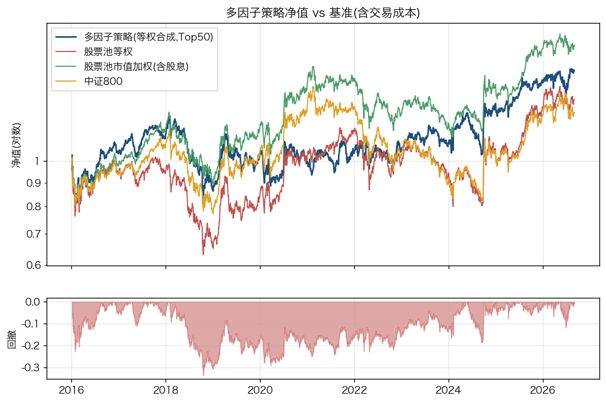
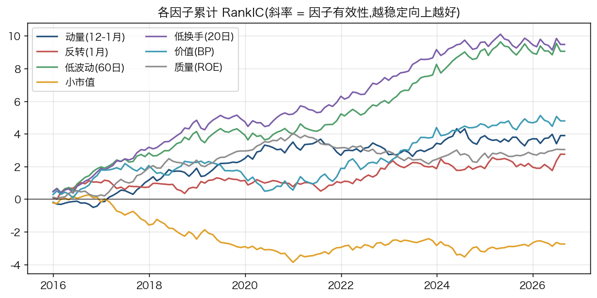
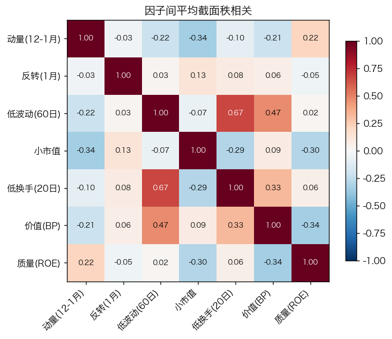
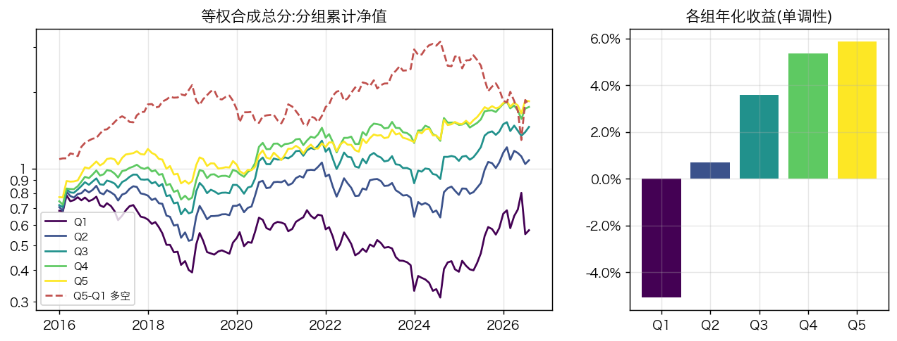
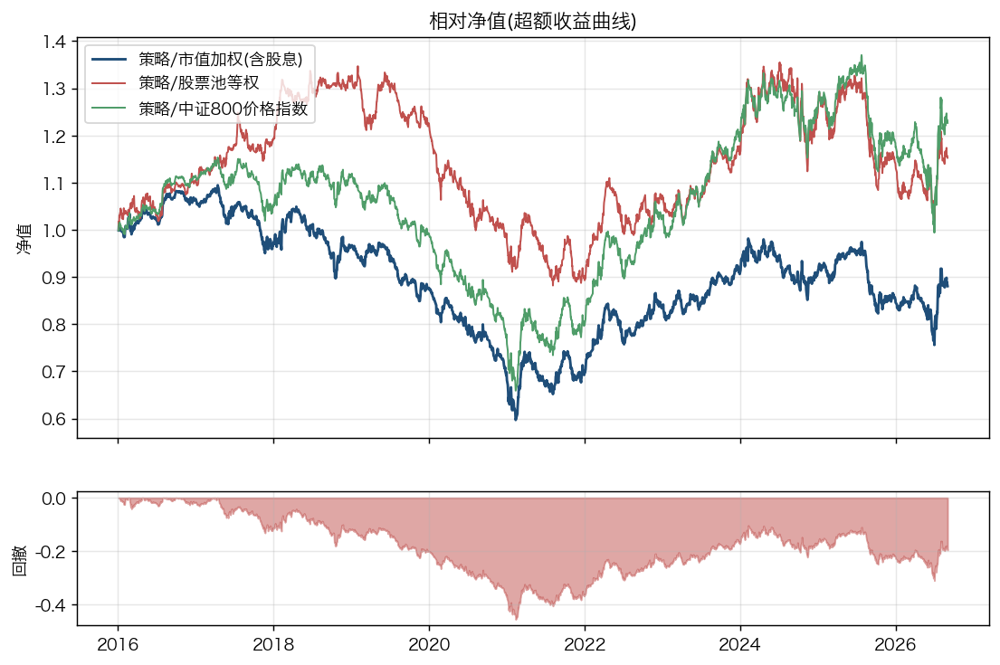
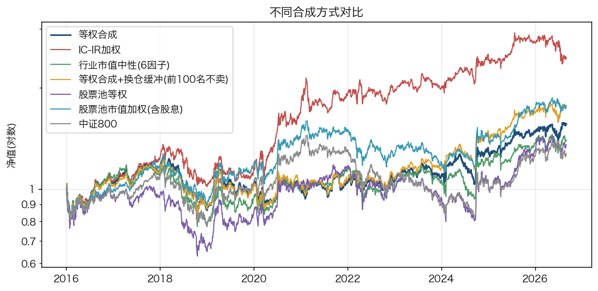
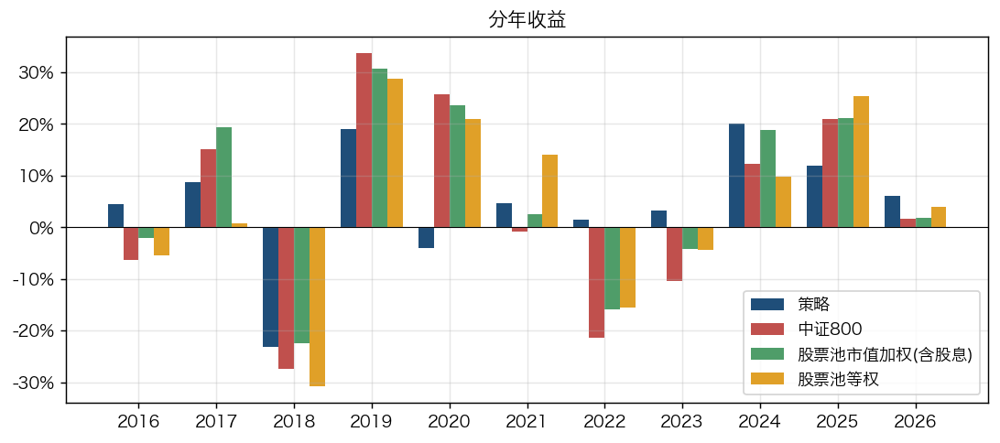
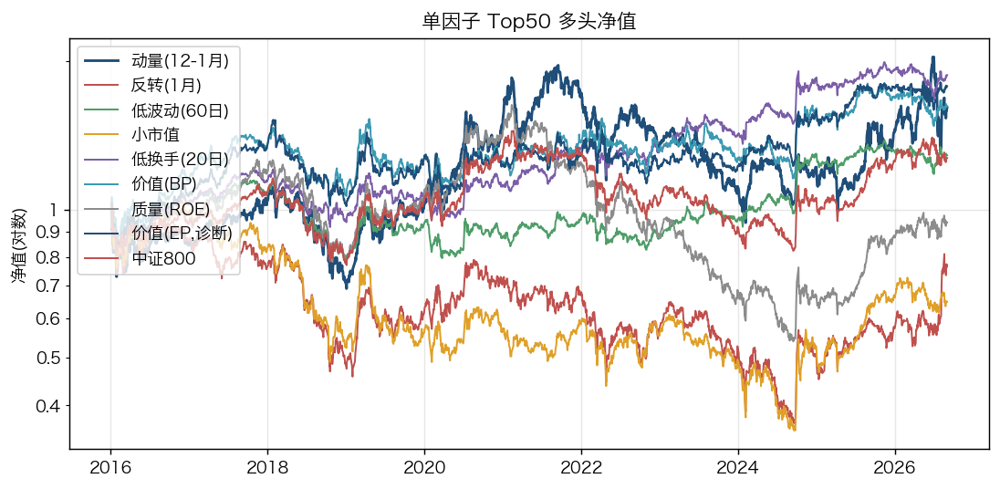
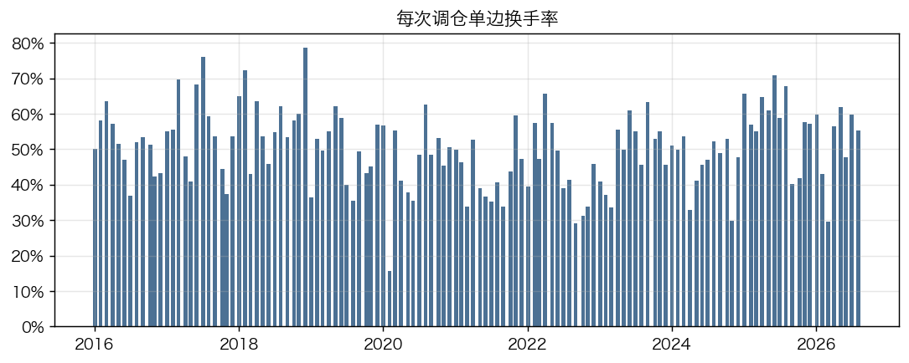

# A 股多因子选股策略:中证 800 股票池的七因子月度轮动

**作业题目:** 完成一个多因子策略,品种任选。
**品种:** A 股(中证 800 时点成分股)。**回测区间:** 2016-01-04 至 2026-08-31(含交易成本)。
**代码:** 本目录 `src/`、`scripts/`,`./run_all.sh` 一键复现;数据来自 baostock 免费接口。

## 1. 摘要

| | 多因子策略 | 中证 800 价格指数 | 股票池市值加权(含股息) | 股票池等权 |
|---|---|---|---|---|
| 年化收益 | **4.3%** | 2.3% | 5.5% | 2.9% |
| 年化波动 | 17.2% | 19.0% | 17.3% | 20.5% |
| 夏普比率 | **0.25** | 0.12 | 0.32 | 0.14 |
| 最大回撤 | -33.7% | -43.0% | -29.8% | -38.2% |
| 相对中证 800 年化超额 | **1.9%** | – | 3.2% | 0.6% |
| 相对市值加权(含股息)年化超额 | **-1.2%**(IR -0.11) | – | – | -2.5% |
| 相对股票池等权年化超额 | **1.3%**(IR 0.12) | – | – | – |
| 年均单边换手 | 599% | – | – | 53% |

**这份作业最重要的结论,可能和直觉相反:因子本身是有效的,但把它做成一个可交易的组合之后,超额收益基本被吃光了。**

七因子合成的月度 RankIC 均值 0.083、ICIR 0.41、Newey-West t 值 5.6、66% 的月份为正,按 A 股卖方研究的经验这是一个相当强的信号;
行业市值中性化后 ICIR 还能升到 0.53、t 值 7.1。但同一个信号做成"买前 50 只、月度换仓、扣成本"的组合后:
相对中证 800 价格指数年化超额 1.9%(信息比率 0.16),而相对同股票池、含股息的市值加权组合是 **−1.2%**(信息比率 −0.11)。
换句话说,相对价格指数那点超额,主要来自"指数不含股息"这个口径差,不是选股能力。

三个原因,后文逐一给证据:

1. **成本**。组合年化单边换手 599%,基准成本下拖累约 2.2 个百分点;把成本调到两倍,超额直接转负。
2. **IC 不等于可交易的 alpha**。IC 度量的是全截面 786 只股票的排序相关性,而 Top 50 只是最极端的 6%。多数因子的五分组多空收益接近零甚至为负——排序对,但极端一端不赚钱。
3. **一个因子的预设方向在样本里失败了**。小市值因子 IC 为 −0.022,单独做 Top 50 年化 −4.0%。我在跑回测前按文献把它的方向定为"市值越小越好",结果相反。我选择保留并如实报告,而不是事后翻符号。

两个改进方向被验证有效:加换仓缓冲(排名仍在前 100 名内就不卖)把换手降到 337%、年化提到 5.4%;
用滚动 IC-IR 加权代替等权,年化 8.8%、相对市值加权组合超额 +3.1%(信息比率 0.31),它的优势主要来自自动降低了失效因子的权重。



## 2. 数据与股票池

**数据源。** 全部数据来自 baostock(免费公开接口):个股日线(后复权收盘价、成交额、换手率、涨跌幅、交易状态、ST 标记、PE_TTM、PB_MRQ;只取用到的字段,因为 baostock 的耗时与字节数成正比)、
沪深 300 / 中证 500 / 中证 800 指数日线、沪深 300 与中证 500 的历史成分股名单、证监会行业分类、上市日期。
数据区间 2014-07 至 2026-08,其中 2014-07 至 2015-12 只用于因子预热(12 个月动量需要一年历史)。

**股票池:中证 800 时点成分股。** 每个月末查询"当时"的沪深 300 + 中证 500 成分股(共 800 只),而不是用今天的名单回溯。
用今天的名单会把已退市、已被剔除的差公司排除在外,人为抬高历史收益(幸存者偏差)。
146 个月末名单合计涉及 1608 只不同股票。选中证 800 而非全市场的原因:流动性和可交易性好,是私募实际可以承载的股票池;
全市场回测中小微盘股贡献的"收益"大多不可实现。

**可交易性过滤(信号日)。** 剔除 ST/*ST、当日停牌、上市不满 120 个交易日的新股。

**衍生字段。**
- 日收益率:后复权收盘价环比,停牌期间记 0。
- 流通市值 = 成交额 ÷ 换手率。换手率 = 成交量 / 流通股本,成交额 = Σ价格×成交量,两者相除即流通股本 × 当日成交均价。停牌日(换手为 0)向前填充。
- 涨跌停判定:按收盘涨跌幅是否贴近该股当日的涨跌幅限制(主板 10%、ST 5%、科创板 20%、创业板 2020-08-24 起 20%)。

## 3. 因子

因子全部来自公开文献中在 A 股有长期记录的风格,**在看到任何回测结果之前就固定下来**,之后没有增删或调参数。方向统一为"值越大、预期收益越高"。

| 因子 | 定义 | 经济逻辑(一句话) |
|---|---|---|
| 动量 12-1 | 过去 12 个月收益,剔除最近 1 个月 | 趋势延续;剔除最近一月是为了与短期反转分开 |
| 反转 1 月 | −(最近 1 个月收益) | A 股短期反转很强:上月涨得多的下月倾向回落 |
| 低波动 | −(过去 60 日日收益标准差) | 低波异象:高波动股票被过度追捧、未来收益偏低 |
| 小市值 | −log(流通市值) | 小盘溢价;A 股历史上非常显著,但 2017 年以来多次反转 |
| 低换手 | −(过去 20 日平均换手率) | 换手率高代表投机情绪高、被过度交易 |
| 价值 BP | 1 / PB | 账面市值比,便宜的股票长期收益更高 |
| 质量 ROE | PB / PE(TTM) | ROE = 净利润 / 净资产 = (P/B)/(P/E);盈利能力强的公司更好 |

**预注册表(方向与依据,在跑任何回测之前固定)。**

| 因子 | 预期方向 | 依据 | 在 A 股的先验 |
|---|---|---|---|
| 动量 12-1 | + | Jegadeesh-Titman (1993) | 弱甚至为负(Chui-Titman-Wei 2010);保留教科书符号,如实报告 |
| 反转 1 月 | + | Jegadeesh (1990);Liu-Stambaugh-Yuan (2019) | 强 |
| 低波动 | + | Ang-Hodrick-Xing-Zhang (2006, 2009) | 较强 |
| 小市值 | + | Banz (1981);LSY (2019) CH-3 规模因子 | 长期强,2017 与 2024 初显著反转 |
| 低换手 | + | Datar-Naik-Radcliffe (1998);LSY (2019) 换手异象 | 强 |
| 价值 BP | + | Fama-French (1993) | 中等;LSY (2019) 认为 A 股 EP 优于 BP,故另加 EP 作诊断因子(不进合成) |
| 质量 ROE | + | Novy-Marx (2013) 盈利能力 | 2017–2021 强 |

我按这张表的符号做合成,**看到结果后不翻符号、不增删因子**。动量在 A 股预期不好,但如果因为它不好就事后剔除,就是在样本内挑选;我选择保留并报告。

**预处理。** 每个月末在股票池内做截面处理:MAD 去极值(3 倍),z-score 标准化。
对照版本另做行业 + 市值中性化(对常数项、对数流通市值和行业虚拟变量回归取残差),用来检查因子有效性是否只是行业或市值的伪装。
两个细节:(1) 市值因子本身只做行业中性;中性化版本的合成不再包含市值因子(否则其它因子的市值暴露被剔除、市值因子的暴露反而被放大);
(2) 行业分类是最新快照,已退市股票没有分类——这些股票不单独成组(否则"无行业"组几乎全是未来退市股,等于泄露未来),而是只做市值中性。

## 4. 检验、合成与组合

**单因子检验。** 月度 RankIC(因子值与下月收益的秩相关)、IC 均值 / 标准差 / ICIR / t 值 / 胜率;
按因子分 5 组等权,看各组收益是否单调;因子间相关性;因子自相关(决定换手)。
下月收益的窗口与实际持有期一致(月末到下月末),不重叠。

**合成。** 主方案:7 个因子 z-score 等权相加。等权是最不容易过拟合的做法。
对照:滚动 12 个月 ICIR 加权(只用截至上月已实现的 IC,负 IR 截为 0),以及行业市值中性化后等权。

**组合与执行。** 月末收盘后按总分排序,取前 50 只等权;下一交易日以收盘价成交。
执行日涨停或停牌的股票买不进,资金按比例分给其他目标股;持仓中跌停或停牌的卖不出,保留仓位到下次调仓。
成本:佣金双边各万 3,印花税卖出万 5,滑点单边千 1。

**基准。** (1) 中证 800 价格指数;(2) 股票池等权组合(同样的过滤、同样的月度调仓和成本)。
第二个基准很重要:Top50 等权组合天然比市值加权指数偏小盘,单看相对指数的超额会把"等权效应"误记为"选股能力"。


## 5. 数据检查

在看任何收益数字之前,先确认数据本身没有骗人。以下检查由 `scripts/03_validate_data.py` 自动生成,完整版见 `results/data_checks.md`。

四项检查的结论:

1. **时点成分股成立。** 2016 年 1 月的名单里有 53 只公司后来退市(武钢股份 2017-02、*ST 保千 2020-06、宏图高科 2023-06 等),说明接口返回的确实是当时的名单,而不是今天的名单回填。名单每 6 月、12 月定期调整,变动中位数 98 只,其它月份中位数为 0,与中证指数的调整规则一致。
2. **行情覆盖率 100%。** 146 个月末、每月 800 只成分股,全部能取到日线数据,包括后来退市的公司。
3. **PE/PB 是时点数据。** 用"每股净资产 = 收盘价 / PB"反推,它的跳变绝大多数落在财报公告日附近而非报告期末,说明估值指标按当时已披露的报表计算,价值和质量因子不含财报前视。
4. **后复权价有个别错误,已修正。** baostock 的后复权收盘价在 23 个"股票-日"上与交易所官方涨跌幅相差超过 1 个百分点(例如平安银行 2020-12-31 复权价 −16.2%、官方 +0.73%),这类错误会永久污染此后的价格链。我用 PB 的日变化作独立裁判(PB 随原始价同步变动),谁更接近就采信谁,并用累计系数重建一条一致的复权价。不修正的话,平安银行的动量因子会在此后 12 个月里偏差 16 到 30 个百分点。修正只用当日及之前的数据,不引入前视。

股票池规模(146 个月末的平均值):

|    |   名单股数 |   有行情数据 |   剔除ST |   剔除停牌 |   剔除新股 |   最终股票池 |   有效总分股数 |
|:---|-------:|--------:|-------:|-------:|-------:|--------:|---------:|
| 平均 |    800 |     800 |    0.7 |   12.5 |    0.4 |   786.5 |    786.5 |

另有两项写成了自动化测试(`tests/test_with_data.py`):
(a) **扰动未来数据测试**:把某个信号日之后的全部价格、成交、估值数据随机乘以 0.5–1.5 的噪声并翻转 ST 标记,该信号日选出的 50 只股票必须完全不变——通过;
(b) 后复权收盘价与交易所官方涨跌幅的一致性——原始数据有 23 个"股票-日"相差超过 1 个百分点,已按第 4 节的方法修正,修正后仅剩官方涨跌幅本身为 0 占位的个别情形。

## 6. 单因子检验结果

|           |   IC均值 |   IC标准差 |   ICIR |    t值 |   t值(NW) | IC>0占比   |   期数 |   IC均值(执行口径) |   因子自相关 |   缺失率 | 多空年化(Q5-Q1)   | Q5年化   | Q1年化   |   单调性(组均值秩相关) |   IC均值(16-21) |   IC均值(22-26) |
|:----------|-------:|--------:|-------:|------:|---------:|:---------|-----:|-------------:|--------:|------:|:--------------|:-------|:-------|--------------:|--------------:|--------------:|
| 动量(12-1月) |   0.03 |    0.21 |   0.14 |  1.63 |     1.9  | 58.6%    |  128 |         0.03 |    0.89 |  0.01 | 8.7%          | 6.1%   | -5.1%  |           1   |          0.04 |          0.02 |
| 反转(1月)    |   0.02 |    0.18 |   0.12 |  1.37 |     1.48 | 46.9%    |  128 |         0.03 |    0.04 |  0    | -1.2%         | 0.6%   | -0.0%  |           0.1 |          0.01 |          0.03 |
| 低波动(60日)  |   0.07 |    0.23 |   0.3  |  3.41 |     4.51 | 65.6%    |  128 |         0.07 |    0.9  |  0.01 | -0.3%         | 4.7%   | -1.7%  |           0.9 |          0.07 |          0.07 |
| 小市值       |  -0.02 |    0.16 |  -0.13 | -1.49 |    -1.59 | 46.9%    |  128 |        -0.02 |    0.99 |  0    | -4.5%         | 0.2%   | 5.1%   |          -0.7 |         -0.04 |          0    |
| 低换手(20日)  |   0.07 |    0.22 |   0.34 |  3.88 |     4.83 | 65.6%    |  128 |         0.08 |    0.88 |  0    | 2.8%          | 5.4%   | -3.5%  |           0.9 |          0.08 |          0.06 |
| 价值(BP)    |   0.04 |    0.23 |   0.17 |  1.87 |     2.14 | 53.1%    |  128 |         0.04 |    0.99 |  0    | -1.4%         | 5.0%   | 1.4%   |           0.6 |          0.02 |          0.05 |
| 质量(ROE)   |   0.02 |    0.15 |   0.16 |  1.81 |     1.72 | 57.0%    |  128 |         0.02 |    0.98 |  0    | 0.7%          | 3.0%   | 0.9%   |           0.9 |          0.04 |         -0    |
| 价值(EP,诊断) |   0.05 |    0.2  |   0.25 |  2.81 |     3.61 | 61.7%    |  128 |         0.05 |    0.98 |  0    | -0.0%         | 4.4%   | 0.9%   |           0.8 |          0.05 |          0.05 |

> IC 为月度 RankIC;t 值(NW)为 Newey-West 修正;"执行口径"指前向收益从 T+1 收盘到下月 T+1 收盘,与回测完全一致。
> 多空年化为 Q5−Q1 等权组合的年化收益(A 股融券受限,多空仅作因子强度度量)。



**IC 衰减**(因子对未来第 k 个月单月收益的平均 RankIC):

|           |    第1月 |    第2月 |    第3月 |    第6月 |   第12月 |
|:----------|-------:|-------:|-------:|-------:|-------:|
| 动量(12-1月) |  0.03  |  0.032 |  0.029 |  0.022 |  0.015 |
| 反转(1月)    |  0.021 |  0.012 | -0.007 | -0.024 | -0.019 |
| 低波动(60日)  |  0.071 |  0.06  |  0.046 |  0.04  |  0.044 |
| 小市值       | -0.022 | -0.022 | -0.024 | -0.023 | -0.016 |
| 低换手(20日)  |  0.074 |  0.059 |  0.049 |  0.041 |  0.039 |
| 价值(BP)    |  0.037 |  0.03  |  0.024 |  0.027 |  0.027 |
| 质量(ROE)   |  0.024 |  0.023 |  0.017 |  0.014 |  0.012 |
| 价值(EP,诊断) |  0.049 |  0.042 |  0.034 |  0.034 |  0.036 |

**因子相关性**(平均截面秩相关):

|             |   mom_12_1 |   rev_1m |   vol_60 |   size |   turnover_20 |    bp |   roe |
|:------------|-----------:|---------:|---------:|-------:|--------------:|------:|------:|
| mom_12_1    |       1    |    -0.03 |    -0.22 |  -0.34 |         -0.1  | -0.21 |  0.22 |
| rev_1m      |      -0.03 |     1    |     0.03 |   0.13 |          0.08 |  0.06 | -0.05 |
| vol_60      |      -0.22 |     0.03 |     1    |  -0.07 |          0.67 |  0.47 |  0.02 |
| size        |      -0.34 |     0.13 |    -0.07 |   1    |         -0.29 |  0.09 | -0.3  |
| turnover_20 |      -0.1  |     0.08 |     0.67 |  -0.29 |          1    |  0.33 |  0.06 |
| bp          |      -0.21 |     0.06 |     0.47 |   0.09 |          0.33 |  1    | -0.34 |
| roe         |       0.22 |    -0.05 |     0.02 |  -0.3  |          0.06 | -0.34 |  1    |



**哪些因子有效。** 低换手(IC 0.074,NW t 4.83)和低波动(0.071,t 4.51)是最强的两个,五分组收益单调性也最好;
价值类里 EP(1/PE)明显强于 BP(0.049 对 0.037),这与 Liu-Stambaugh-Yuan (2019) 关于"A 股用 EP 优于 BP"的结论一致——
EP 是我事先放进来只做检验、不进合成的诊断因子,它的表现说明合成里的价值维度选错了代理变量。
动量(t 1.90)和质量(t 1.72)偏弱但方向正确,一月反转(t 1.48)在中证 800 这样的中大盘池子里比全市场弱得多。

**小市值因子的预设方向失败了。** IC 为 −0.022,五分组单调性 −0.7,单独做 Top 50 年化 −4.0%、信息比率 −0.46,是七个因子里最差的。
我在回测前按 Banz (1981) 和 A 股的长期经验把方向定为"市值越小越好",样本里恰好相反:2016 到 2021 年 IC 是 −0.038,
这段时间正是 A 股从"炒小炒差"转向核心资产的阶段。事后剔除或翻转它会让业绩好看很多,但那是样本内挑选,所以我保留了它。

**一个容易被忽略的信号:IC 为正,多空收益却接近零。** 低波动因子 IC 高达 0.071,但五分组的 Q5 减 Q1 年化只有 −0.3%;
低换手是 +2.8%。这说明因子把 786 只股票的相对排序排对了,但排序两端的收益差并不大。
这是后面"组合超额远小于 IC 暗示的水平"的直接前兆,也是我认为这份作业里最值得讲的一点。

**因子相关性。** 低波动与低换手的截面秩相关 0.67,是唯一一对高度重叠的因子;其余多在 ±0.35 以内。
各因子对 log 流通市值的相关性显示,动量(0.34)、质量(0.30)、低换手(0.29)都带明显的大市值倾向,
这也是为什么中性化版本值得单独看:剥掉市值和行业以后,合成信号的 ICIR 反而从 0.41 升到 0.53。

各因子的月度 IC 与分层净值图见 `figures/ic_<factor>.png` 和 `figures/quantile_<factor>.png`。

## 7. 因子合成与组合表现

合成总分的 IC:

|             |   IC均值 |   IC标准差 |   ICIR |   t值 |   t值(NW) | IC>0占比   |   期数 |
|:------------|-------:|--------:|-------:|-----:|---------:|:---------|-----:|
| 等权合成        |   0.08 |    0.2  |   0.41 | 4.66 |     5.61 | 66.4%    |  128 |
| IC-IR加权     |   0.08 |    0.22 |   0.34 | 3.89 |     4.5  | 68.0%    |  128 |
| 行业市值中性(6因子) |   0.07 |    0.14 |   0.53 | 5.96 |     7.14 | 72.7%    |  128 |



策略与基准的完整绩效(相对中证 800 价格指数):

|                    | 年化收益   | 年化波动   |   夏普比率 | 最大回撤   |   Calmar | 最大回撤起止                | 累计收益   | 基准年化收益   | 年化超额收益   | 跟踪误差   | 信息比率   |   Beta | 超额最大回撤   | 月度胜率(vs基准)   | 年均单边换手   | 平均持股数   |
|:-------------------|:-------|:-------|-------:|:-------|---------:|:----------------------|:-------|:---------|:---------|:-------|:-------|-------:|:---------|:-------------|:---------|:--------|
| 等权合成               | 4.3%   | 17.2%  |   0.25 | -33.7% |     0.13 | 2018-01-29~2018-10-18 | 56.0%  | 2.3%     | 1.9%     | 11.9%  | 0.16   |   0.71 | -42.9%   | 51.2%        | 598.5%   | 50.44   |
| IC-IR加权            | 8.8%   | 18.3%  |   0.48 | -25.2% |     0.35 | 2018-01-23~2019-01-02 | 145.7% | 2.3%     | 6.4%     | 11.2%  | 0.57   |   0.79 | -28.5%   | 59.1%        | 431.0%   | 50.27   |
| 行业市值中性(6因子)        | 3.2%   | 18.1%  |   0.17 | -34.4% |     0.09 | 2017-04-13~2018-10-18 | 39.3%  | 2.3%     | 0.9%     | 9.1%   | 0.09   |   0.84 | -41.3%   | 53.5%        | 657.3%   | 50.53   |
| 等权合成+换仓缓冲(前100名不卖) | 5.4%   | 17.1%  |   0.32 | -32.5% |     0.17 | 2018-01-26~2018-10-18 | 75.9%  | 2.3%     | 3.1%     | 12.2%  | 0.25   |   0.7  | -40.9%   | 54.3%        | 336.8%   | 50.47   |
| 股票池等权              | 2.9%   | 20.5%  |   0.14 | -38.2% |     0.08 | 2017-10-13~2018-10-18 | 35.3%  | 2.3%     | 0.6%     | 6.5%   | 0.09   |   1.02 | -29.6%   | 54.3%        | 52.9%    | 798.02  |
| 股票池市值加权(含股息)       | 5.5%   | 17.3%  |   0.32 | -29.8% |     0.18 | 2018-01-24~2019-01-03 | 77.1%  | 2.3%     | 3.2%     | 3.2%   | 0.99   |   0.9  | -7.8%    | 66.9%        | 21.8%    | 798.02  |
| 中证800              | 2.3%   | 19.0%  |   0.12 | -43.0% |     0.05 | 2021-02-19~2024-09-13 | 27.2%  | 2.3%     | 0.0%     | 0.0%   | -      |   1    | 0.0%     | 0.0%         | -        | -       |

相对"股票池市值加权(含股息)"——即剔除股息口径差异后的公平基准:

|                    | 年化收益   | 年化波动   |   夏普比率 | 最大回撤   |   Calmar | 最大回撤起止                | 累计收益   | 基准年化收益   | 年化超额收益   | 跟踪误差   |   信息比率 |   Beta | 超额最大回撤   | 月度胜率(vs基准)   |
|:-------------------|:-------|:-------|-------:|:-------|---------:|:----------------------|:-------|:---------|:---------|:-------|-------:|-------:|:---------|:-------------|
| 等权合成               | 4.3%   | 17.2%  |   0.25 | -33.7% |     0.13 | 2018-01-29~2018-10-18 | 56.0%  | 5.5%     | -1.2%    | 10.4%  |  -0.11 |   0.81 | -45.5%   | 46.5%        |
| IC-IR加权            | 8.8%   | 18.3%  |   0.48 | -25.2% |     0.35 | 2018-01-23~2019-01-02 | 145.7% | 5.5%     | 3.1%     | 10.0%  |   0.31 |   0.89 | -27.0%   | 55.1%        |
| 行业市值中性(6因子)        | 3.2%   | 18.1%  |   0.17 | -34.4% |     0.09 | 2017-04-13~2018-10-18 | 39.3%  | 5.5%     | -2.2%    | 8.7%   |  -0.26 |   0.92 | -44.0%   | 48.8%        |
| 等权合成+换仓缓冲(前100名不卖) | 5.4%   | 17.1%  |   0.32 | -32.5% |     0.17 | 2018-01-26~2018-10-18 | 75.9%  | 5.5%     | -0.1%    | 10.6%  |  -0.01 |   0.8  | -43.1%   | 46.5%        |
| 股票池等权              | 2.9%   | 20.5%  |   0.14 | -38.2% |     0.08 | 2017-10-13~2018-10-18 | 35.3%  | 5.5%     | -2.5%    | 7.8%   |  -0.32 |   1.1  | -34.8%   | 42.5%        |

相对"股票池等权"——剔除等权效应后,纯因子选股的贡献:

|                    | 年化收益   | 年化波动   |   夏普比率 | 最大回撤   |   Calmar | 最大回撤起止                | 累计收益   | 基准年化收益   | 年化超额收益   | 跟踪误差   |   信息比率 |   Beta | 超额最大回撤   | 月度胜率(vs基准)   |
|:-------------------|:-------|:-------|-------:|:-------|---------:|:----------------------|:-------|:---------|:---------|:-------|-------:|-------:|:---------|:-------------|
| 等权合成               | 4.3%   | 17.2%  |   0.25 | -33.7% |     0.13 | 2018-01-29~2018-10-18 | 56.0%  | 2.9%     | 1.3%     | 11.1%  |   0.12 |   0.71 | -34.5%   | 52.0%        |
| IC-IR加权            | 8.8%   | 18.3%  |   0.48 | -25.2% |     0.35 | 2018-01-23~2019-01-02 | 145.7% | 2.9%     | 5.7%     | 13.2%  |   0.44 |   0.69 | -35.3%   | 56.7%        |
| 行业市值中性(6因子)        | 3.2%   | 18.1%  |   0.17 | -34.4% |     0.09 | 2017-04-13~2018-10-18 | 39.3%  | 2.9%     | 0.3%     | 7.2%   |   0.04 |   0.83 | -26.2%   | 53.5%        |
| 等权合成+换仓缓冲(前100名不卖) | 5.4%   | 17.1%  |   0.32 | -32.5% |     0.17 | 2018-01-26~2018-10-18 | 75.9%  | 2.9%     | 2.5%     | 11.4%  |   0.22 |   0.69 | -33.8%   | 54.3%        |
| 股票池市值加权(含股息)       | 5.5%   | 17.3%  |   0.32 | -29.8% |     0.18 | 2018-01-24~2019-01-03 | 77.1%  | 2.9%     | 2.5%     | 7.8%   |   0.33 |   0.79 | -20.0%   | 57.5%        |





**信号强、组合弱,差距在哪。** 把上面这个 t 值 5.6 的信号做成组合后:
年化收益 4.3%、夏普 0.25、最大回撤 −33.7%;相对中证 800 价格指数超额 1.9%,相对含股息的市值加权组合是 −1.2%。
中证 800 价格指数不含股息,而我的组合用后复权价、隐含分红再投,所以那 1.9% 里大部分是口径差。
诚实的结论是:**这套等权合成的 Top 50 组合没有产生可靠的选股 alpha。**

**三个变体的对比说明了问题出在哪。**

- **换仓缓冲**(已持有且排名仍在前 100 名内就不卖):换手从 599% 降到 337%,年化从 4.3% 升到 5.4%,相对指数信息比率 0.16 升到 0.25。纯粹靠省成本,没有改变任何因子。
- **滚动 IC-IR 加权**:年化 8.8%、夏普 0.48,相对市值加权组合超额 +3.1%、信息比率 0.31,是唯一一个相对公平基准为正的变体。它只用截至上月已实现的 IC 定权重,没有前视。它赢在自动把失效的小市值因子权重压到接近零。但要说明:这是我尝试的三种合成方式之一,单看它的业绩有挑选的成分。
- **行业市值中性(6 因子)**:IC 层面最强(ICIR 0.53),组合层面最差(年化 3.2%)。原因是中性化剥掉了市值和行业暴露,而这段时间里组合的正收益恰恰有不少来自这些暴露。这个反差本身说明:IC 高低和组合能不能赚钱是两件事。

**换手率是这个策略最大的问题。** 年化单边换手 599%,意味着每月要换掉大约一半的持仓。
根源在于合成信号里混了快慢差异极大的因子:一月反转的月度自相关只有 0.04(几乎每月全变),而市值和 BP 高达 0.99(几乎不变)。
等权把它们加在一起,总分的排序被快因子主导,换手自然高。

### 分年表现

|      | 策略     | 中证800   | 股票池市值加权(含股息)   | 股票池等权   | 超额(vs中证800)   | 策略年内最大回撤   |
|-----:|:-------|:--------|:---------------|:--------|:--------------|:-----------|
| 2016 | 4.4%   | -6.3%   | -2.0%          | -5.4%   | 11.5%         | -22.6%     |
| 2017 | 8.8%   | 15.2%   | 19.3%          | 0.8%    | -5.5%         | -11.1%     |
| 2018 | -23.2% | -27.4%  | -22.5%         | -30.8%  | 5.8%          | -33.7%     |
| 2019 | 19.0%  | 33.7%   | 30.8%          | 28.8%   | -11.0%        | -16.9%     |
| 2020 | -3.9%  | 25.8%   | 23.7%          | 21.0%   | -23.6%        | -16.1%     |
| 2021 | 4.7%   | -0.8%   | 2.5%           | 14.0%   | 5.5%          | -10.7%     |
| 2022 | 1.5%   | -21.3%  | -16.0%         | -15.6%  | 29.0%         | -12.8%     |
| 2023 | 3.2%   | -10.4%  | -4.3%          | -4.4%   | 15.2%         | -9.9%      |
| 2024 | 20.1%  | 12.2%   | 18.9%          | 9.9%    | 7.0%          | -18.6%     |
| 2025 | 11.9%  | 20.9%   | 21.1%          | 25.4%   | -7.4%         | -7.7%      |
| 2026 | 6.1%   | 1.7%    | 1.8%           | 4.0%    | 4.3%          | -11.8%     |



### 分段表现

|                                | 年化收益   | 年化波动   |   夏普比率 | 最大回撤   |   Calmar | 最大回撤起止                | 累计收益   | 基准年化收益   | 年化超额收益   | 跟踪误差   | 信息比率   |   Beta | 超额最大回撤   | 月度胜率(vs基准)   |
|:-------------------------------|:-------|:-------|-------:|:-------|---------:|:----------------------|:-------|:---------|:---------|:-------|:-------|-------:|:---------|:-------------|
| 2016-2021 | 等权合成               | 0.8%   | 18.1%  |   0.04 | -33.7% |     0.02 | 2018-01-29~2018-10-18 | 4.7%   | 4.6%     | -3.7%    | 10.5%  | -0.35  |   0.79 | -42.9%   | 45.1%        |
| 2016-2021 | IC-IR加权            | 11.5%  | 19.6%  |   0.59 | -25.2% |     0.46 | 2018-01-23~2019-01-02 | 92.4%  | 4.6%     | 6.7%     | 9.2%   | 0.73   |   0.9  | -20.9%   | 56.3%        |
| 2016-2021 | 行业市值中性(6因子)        | 2.4%   | 18.7%  |   0.13 | -34.4% |     0.07 | 2017-04-13~2018-10-18 | 15.2%  | 4.6%     | -2.1%    | 8.7%   | -0.24  |   0.86 | -41.3%   | 45.1%        |
| 2016-2021 | 等权合成+换仓缓冲(前100名不卖) | 1.1%   | 17.9%  |   0.06 | -32.5% |     0.03 | 2018-01-26~2018-10-18 | 6.8%   | 4.6%     | -3.3%    | 10.6%  | -0.31  |   0.78 | -40.9%   | 50.7%        |
| 2016-2021 | 股票池等权              | 2.7%   | 21.0%  |   0.13 | -38.2% |     0.07 | 2017-10-13~2018-10-18 | 17.2%  | 4.6%     | -1.8%    | 7.0%   | -0.26  |   1.03 | -29.6%   | 53.5%        |
| 2016-2021 | 股票池市值加权(含股息)       | 7.0%   | 18.0%  |   0.39 | -29.8% |     0.24 | 2018-01-24~2019-01-03 | 50.2%  | 4.6%     | 2.3%     | 2.7%   | 0.88   |   0.92 | -6.2%    | 64.8%        |
| 2016-2021 | 中证800              | 4.6%   | 19.3%  |   0.24 | -33.2% |     0.14 | 2018-01-24~2019-01-03 | 30.8%  | 4.6%     | 0.0%     | 0.0%   | -      |   1    | 0.0%     | 0.0%         |
| 2022-2026 | 等权合成               | 8.7%   | 16.1%  |   0.54 | -18.6% |     0.47 | 2024-05-22~2024-09-11 | 47.7%  | -0.5%    | 9.3%     | 13.5%  | 0.69   |   0.61 | -27.5%   | 58.2%        |
| 2022-2026 | IC-IR加权            | 5.2%   | 16.6%  |   0.31 | -19.2% |     0.27 | 2025-07-24~2026-07-30 | 26.4%  | -0.5%    | 5.7%     | 13.3%  | 0.43   |   0.64 | -28.5%   | 61.8%        |
| 2022-2026 | 行业市值中性(6因子)        | 4.0%   | 17.3%  |   0.23 | -21.7% |     0.19 | 2022-01-12~2022-04-26 | 20.3%  | -0.5%    | 4.6%     | 9.5%   | 0.48   |   0.8  | -23.3%   | 63.6%        |
| 2022-2026 | 等权合成+换仓缓冲(前100名不卖) | 11.1%  | 15.9%  |   0.7  | -16.0% |     0.69 | 2024-05-22~2024-09-11 | 63.1%  | -0.5%    | 11.7%    | 13.9%  | 0.84   |   0.59 | -27.0%   | 58.2%        |
| 2022-2026 | 股票池等权              | 3.0%   | 19.7%  |   0.15 | -32.0% |     0.1  | 2022-01-04~2024-02-05 | 15.0%  | -0.5%    | 3.6%     | 5.9%   | 0.61   |   1.01 | -10.1%   | 56.4%        |
| 2022-2026 | 股票池市值加权(含股息)       | 3.6%   | 16.4%  |   0.22 | -24.9% |     0.15 | 2022-01-04~2024-02-02 | 18.0%  | -0.5%    | 4.2%     | 3.8%   | 1.10   |   0.87 | -7.8%    | 69.1%        |
| 2022-2026 | 中证800              | -0.5%  | 18.6%  |  -0.03 | -36.8% |    -0.01 | 2022-01-04~2024-09-13 | -2.4%  | -0.5%    | 0.0%     | 0.0%   | -      |   1    | 0.0%     | 0.0%         |

分段结果差异极大,必须说清楚:2016 到 2021 年,策略相对中证 800 的年化超额是 **−3.7%**(信息比率 −0.35);
2022 到 2026 年是 **+9.3%**(信息比率 0.69)。同一套因子、同一套规则,前后两段是相反的结论。

我的解读:前半段是 A 股的"核心资产"行情,2017 年大盘蓝筹独涨(策略 8.8% 对指数 15.2%)、2019 到 2020 年成长股和高估值板块领涨
(2020 年策略 −3.9% 对指数 25.8%,是全样本最差的一年),而我这套因子以低波动、低换手、便宜为主,风格正好相反。
后半段市场转向低估值和防御,策略的风格重新占优,2022 年超额 29.0%、2023 年 15.2%。

这不是"策略在 2022 年之后变好了",而是"这套因子暴露在某类市场环境里赚钱、在另一类里亏钱"。
对面试而言我更愿意把它讲成一个风险提示:**这份作业里的超额收益,风格 beta 的成分大于稳定 alpha 的成分。**
真要做成产品,必须加风险模型约束住风格暴露,而不是靠运气赌环境。

### 单因子 Top50 多头(每个因子单独选股)

|           | 年化收益   | 年化波动   |   夏普比率 | 最大回撤   |   Calmar | 最大回撤起止                | 累计收益   | 基准年化收益   | 年化超额收益   | 跟踪误差   |   信息比率 |   Beta | 超额最大回撤   | 月度胜率(vs基准)   |
|:----------|:-------|:-------|-------:|:-------|---------:|:----------------------|:-------|:---------|:---------|:-------|-------:|-------:|:---------|:-------------|
| 动量(12-1月) | 4.6%   | 27.9%  |   0.16 | -52.1% |     0.09 | 2021-09-15~2024-02-05 | 61.0%  | 2.3%     | 2.2%     | 15.5%  |   0.14 |   1.25 | -31.7%   | 49.6%        |
| 反转(1月)    | -2.4%  | 26.3%  |  -0.09 | -63.8% |    -0.04 | 2016-01-06~2024-09-18 | -22.9% | 2.3%     | -4.6%    | 15.0%  |  -0.3  |   1.14 | -59.4%   | 38.6%        |
| 低波动(60日)  | 2.4%   | 14.0%  |   0.17 | -30.6% |     0.08 | 2017-10-26~2019-01-02 | 28.8%  | 2.3%     | 0.1%     | 12.5%  |   0.01 |   0.55 | -46.7%   | 50.4%        |
| 小市值       | -4.0%  | 24.1%  |  -0.16 | -66.0% |    -0.06 | 2016-11-22~2024-09-18 | -35.0% | 2.3%     | -6.1%    | 13.4%  |  -0.46 |   1.05 | -66.4%   | 45.7%        |
| 低换手(20日)  | 6.1%   | 14.7%  |   0.41 | -23.6% |     0.26 | 2018-01-26~2018-10-18 | 87.4%  | 2.3%     | 3.7%     | 11.6%  |   0.32 |   0.61 | -37.6%   | 52.8%        |
| 价值(BP)    | 4.6%   | 18.5%  |   0.25 | -30.6% |     0.15 | 2018-01-26~2018-10-18 | 61.8%  | 2.3%     | 2.3%     | 13.4%  |   0.17 |   0.73 | -43.3%   | 50.4%        |
| 质量(ROE)   | -0.6%  | 22.0%  |  -0.03 | -66.9% |    -0.01 | 2021-02-10~2024-09-13 | -6.0%  | 2.3%     | -2.8%    | 8.3%   |  -0.34 |   1.07 | -46.6%   | 51.2%        |
| 价值(EP,诊断) | 5.6%   | 18.2%  |   0.31 | -33.2% |     0.17 | 2018-01-26~2019-01-02 | 77.9%  | 2.3%     | 3.2%     | 13.5%  |   0.24 |   0.7  | -37.0%   | 55.1%        |



## 8. 稳健性与敏感性

|                      | 年化收益   | 年化波动   |   夏普比率 | 最大回撤   |   Calmar | 最大回撤起止                | 累计收益   | 基准年化收益   | 年化超额收益   | 跟踪误差   |   信息比率 |   Beta | 超额最大回撤   | 月度胜率(vs基准)   | 年均单边换手   |
|:---------------------|:-------|:-------|-------:|:-------|---------:|:----------------------|:-------|:---------|:---------|:-------|-------:|-------:|:---------|:-------------|:---------|
| 成本 | 零成本             | 6.5%   | 17.3%  |   0.37 | -32.5% |     0.2  | 2018-01-29~2018-10-18 | 94.7%  | 2.3%     | 4.1%     | 11.9%  |   0.34 |   0.72 | -38.9%   | 52.8%        | -        |
| 成本 | 基准成本            | 4.3%   | 17.2%  |   0.25 | -33.7% |     0.13 | 2018-01-29~2018-10-18 | 56.0%  | 2.3%     | 1.9%     | 11.9%  |   0.16 |   0.71 | -42.9%   | 51.2%        | -        |
| 成本 | 两倍成本            | 2.1%   | 17.2%  |   0.12 | -34.9% |     0.06 | 2018-01-29~2018-10-18 | 24.9%  | 2.3%     | -0.2%    | 12.0%  |  -0.01 |   0.71 | -47.6%   | 50.4%        | -        |
| 持股数 | Top30          | 4.4%   | 17.5%  |   0.25 | -33.3% |     0.13 | 2018-01-26~2018-10-18 | 58.4%  | 2.3%     | 2.1%     | 12.6%  |   0.16 |   0.7  | -43.7%   | 49.6%        | -        |
| 持股数 | Top50          | 4.3%   | 17.2%  |   0.25 | -33.7% |     0.13 | 2018-01-29~2018-10-18 | 56.0%  | 2.3%     | 1.9%     | 11.9%  |   0.16 |   0.71 | -42.9%   | 51.2%        | -        |
| 持股数 | Top100         | 5.1%   | 17.3%  |   0.29 | -33.5% |     0.15 | 2018-01-26~2018-10-18 | 69.3%  | 2.3%     | 2.7%     | 11.1%  |   0.25 |   0.74 | -39.1%   | 52.0%        | -        |
| 退市持仓处理 | 按最后价格变现(基准) | 4.3%   | 17.2%  |   0.25 | -33.7% |     0.13 | 2018-01-29~2018-10-18 | 56.0%  | 2.3%     | 1.9%     | 11.9%  |   0.16 |   0.71 | -42.9%   | 51.2%        | -        |
| 退市持仓处理 | 再折价30%      | 4.3%   | 17.2%  |   0.25 | -33.7% |     0.13 | 2018-01-29~2018-10-18 | 56.0%  | 2.3%     | 1.9%     | 11.9%  |   0.16 |   0.71 | -42.9%   | 51.2%        | -        |
| 退市持仓处理 | 全额损失        | 4.3%   | 17.2%  |   0.25 | -33.7% |     0.13 | 2018-01-29~2018-10-18 | 56.0%  | 2.3%     | 1.9%     | 11.9%  |   0.16 |   0.71 | -42.9%   | 51.2%        | -        |
| 换仓缓冲 | 前50名不卖        | 4.3%   | 17.2%  |   0.25 | -33.7% |     0.13 | 2018-01-29~2018-10-18 | 56.0%  | 2.3%     | 1.9%     | 11.9%  |   0.16 |   0.71 | -42.9%   | 51.2%        | 598.5%   |
| 换仓缓冲 | 前100名不卖       | 5.4%   | 17.1%  |   0.32 | -32.5% |     0.17 | 2018-01-26~2018-10-18 | 75.9%  | 2.3%     | 3.1%     | 12.2%  |   0.25 |   0.7  | -40.9%   | 54.3%        | 336.8%   |
| 换仓缓冲 | 前150名不卖       | 5.4%   | 17.1%  |   0.31 | -33.2% |     0.16 | 2018-01-26~2018-10-18 | 74.5%  | 2.3%     | 3.0%     | 12.3%  |   0.25 |   0.7  | -40.3%   | 53.5%        | 237.8%   |



**成本是决定性的。** 零成本下年化 6.5%、超额 4.1%;基准成本下 4.3%、1.9%;成本翻倍后 2.1%、超额 −0.2%。
也就是说这个策略的全部超额都在交易成本的量级上,成本假设稍微保守一点结论就翻盘。
这是我认为这份作业最需要向面试官强调的一条:**任何不报告成本敏感性的月度多因子回测结果都不可信。**

**持股数不敏感。** Top 30、50、100 的年化在 4.3% 到 5.1% 之间,Top 100 略好(分散度更高、换手略低)。说明结论不依赖 50 这个数字。

**换仓缓冲有效。** 前 100 名不卖:换手降 44%,超额从 1.9% 升到 3.1%;前 150 名不卖效果相近。
再次印证问题出在成本而非信号。

**退市处理不影响结果。** 全样本里没有一次"持仓股数据序列终止"事件,所以三档退市折价假设的结果完全相同。
原因是中证 800 的公司在退市前会先被调出指数,因而也就先离开了我的股票池。这是选中大盘股票池的一个附带好处,
如果换成全市场小微盘池,这一项就会变得很关键。

**执行约束的影响很小。** 全样本 129 次调仓中,因执行日涨停或停牌而没买进的目标股共 8 只,占比可以忽略。
这也是中证 800 流动性好的体现。

## 9. 局限与诚实声明

按重要性排序。每一条都是我知道、但在这份作业的时间和免费数据约束下没有完全解决的问题。

1. **行业分类只有最新快照。** baostock 只提供当前的证监会行业分类,已退市股票没有行业(归入 UNK 组)。这使"行业市值中性化"版本带有轻微前视和幸存者成分,所以中性化版本只作对照,主结果不依赖它。
2. **流通市值是推算值。** 成交额 ÷ 换手率 得到的是流通股本 × 当日成交均价,与"流通股本 × 收盘价"相差通常在 1% 以内;对以 log 市值排序的规模因子影响可忽略,但不能拿它做精确的市值加权。
3. **基本面因子只有 PE/PB 派生。** 没有用到营收增长、现金流、应计项目等,质量维度只有 ROE 一个代理。PE/PB 由数据源按当时已披露报表计算(第 5 节验证了它按公告日更新),但我没有独立重算。
4. **成交价假设是 T+1 收盘价。** 实盘用 VWAP 或分批成交;对 50 只中证 800 成分股、月度换仓的规模,收盘价假设的偏差主要体现在滑点,已用千 1 滑点覆盖。
5. **涨跌停用收盘涨跌幅判定。** 盘中触及涨停但收盘打开的股票被视为可成交,略偏乐观;反过来一字板全天封死的情况已正确剔除。
6. **股票池不含全市场。** 中证 800 以外的小微盘股不在样本内,这是有意为之(可交易性),但也意味着本文关于小市值因子的结论只适用于中大盘范围。
7. **没有做参数搜索,也没有样本外"预留期"的正式协议。** 7 个因子、窗口长度、Top 50、月度调仓全部事先设定;我用 2016–2021 与 2022–2026 分段来展示稳定性,但这不是严格意义上的样本外验证——因为因子本身来自我事先知道的公开文献,而这些文献本身是在 A 股历史数据上写出来的。
8. **退市处理在本样本里没有被触发。** 持仓股数据序列终止时按最后一个有效价格变现,并提供了折价 30% 和全额损失两档敏感性。
   全样本里这类事件发生 0 次——中证 800 的公司在退市前会先被调出指数、也就先离开了股票池。这意味着本文的结论对退市假设不敏感,
   但也意味着如果换成全市场小微盘股票池,这一项必须重新处理。
9. **价格指数基准不含股息。** 中证 800 价格指数每年少算约 1.5–2.5% 股息,因此我额外构建了同股票池的市值加权、含股息组合作为公平基准,主要结论以它为准。
10. **策略没有考虑容量、冲击成本随规模的变化、融资融券和对冲。** 这是一个"多头选股"作业,不是产品方案。
11. **变体的选择本身带有事后成分。** 我报告了等权、IC-IR 加权、行业市值中性、换仓缓冲四个版本,其中 IC-IR 加权表现最好。
    这四个版本是事先设定的对照组而非搜索出来的,但"在四个里挑最好的那个讲"仍然会高估其样本外表现,因此正文以等权版本为主结论。
12. **后复权价的修正依赖 PB 作裁判。** 23 个被修正的单元格中,判断依据是"PB 的日变化更接近哪一边"。
    在 PB 数据本身缺失或停牌前值填充的日子,这个裁判会失灵——修正后仍有 5 处 1 到 3 个百分点的分歧未能判定,已在测试中记录。

## 10. 如果再给我两周

- 补历史行业分类和更完整的财务数据(如 tushare 积分或 Wind),把中性化做成主方案。
- 因子扩展:盈利增长、应计质量、分析师预期修正、北向资金流;并做因子拥挤度监控。
- 组合层:用风险模型做波动约束、行业偏离约束和换手惩罚的优化,而不是简单等权 Top 50。
- 用滚动窗口做严格的 walk-forward 检验,把"因子权重"当作可学习参数,报告纯样本外表现。
- 把 ML 背景用上:在同一套无前视的数据管道上,用树模型/线性模型学因子到收益的非线性映射,和等权基线对比。


## 11. 结论

1. **流程是标准的,数据是干净的。** 时点成分股、后复权价校正、T+1 成交、涨跌停与停牌约束、时变印花税、
   两个基准、预注册的因子方向,以及一个"扰动未来数据、选股结果必须不变"的自动化前视检验。这些是我认为一份多因子作业的及格线。
2. **信号有效,但不等于策略有效。** 合成因子的 RankIC 在统计上很显著(NW t 5.6),而 Top 50 组合相对公平基准的超额是 −1.2%。
   差距来自交易成本(年化换手 599%)、Top 50 只取全截面最极端的 6%,以及小市值因子预设方向的失败。
3. **可交易性上的改进比找新因子更有价值。** 仅仅加一个换仓缓冲规则(不改任何因子),超额就从 1.9% 提高到 3.1%。
4. **结果高度依赖市场环境。** 2016 到 2021 年超额为负,2022 到 2026 年为正。这套组合的风格暴露成分大于稳定 alpha。

如果这套东西要往产品方向走,我的优先级是:先用风险模型约束风格和行业暴露、把换手压到 200% 以内,
再考虑扩充因子库;而不是先去堆因子数量。

---

### 附录 A:复现

```bash
pip install -r requirements.txt
python scripts/01_download.py          # baostock 下载,约 1 小时,断点续传
python scripts/02_run_pipeline.py      # 全部检验、回测、图表
python scripts/03_validate_data.py     # 数据检查
python scripts/04_build_report.py      # 生成本报告
python tests/test_core.py && python tests/test_with_data.py
```

运行环境:Python 3.9,pandas 2.3,numpy 2.0,statsmodels 0.14,baostock 0.8。流程耗时 0.9 分钟(不含下载)。

### 附录 B:参数一览

| 参数 | 取值 |
|---|---|
| 股票池 | 中证 800 时点成分股,剔除 ST / 停牌 / 上市不足 120 交易日 |
| 信号日 / 成交日 | 月末收盘 / 下一交易日收盘 |
| 持股数 | 50,等权 |
| 因子 | 动量 12-1、反转 1 月、低波动 60 日、小市值、低换手 20 日、BP、ROE |
| 预处理 | MAD 3 倍去极值,z-score;对照版本加行业+市值中性化 |
| 合成 | 等权;对照版本滚动 12 月 ICIR 加权 |
| 成本 | 佣金双边万 3,印花税卖出千 1(2023-08-28 起万 5),滑点单边千 1 |
| 涨跌停 | 主板 10%、ST 5%、科创板 20%、创业板 2020-08-24 起 20%;收盘涨跌幅贴近限制即视为封板 |
| 数据 | baostock;1608 只股票 × 2014-07-01 至 2026-08-31 日线 |
